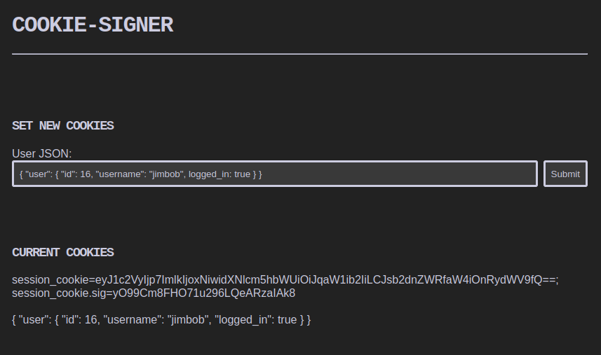

# Express-Cookie-Signer
Signs an Express Cookie using a predefined name and key. Displays the cookie and its signed counterpart on a webpage.


## Installation

Clone the repo and use `npm` to install all dependencies:

```bash
git clone https://github.com/4wayhandshake/Express-Cookie-Signer.git
cd Express-Cookie-Signer
npm i
```


## Usage

First, start the server using, providing the name of the cookie and the signing key as command-line arguments.

For example:

```
node app.js session_cookie "892123456789418902481234567890634518936754"
```

Then interact with the index page to sign any provided json-like input:




---

Enjoy

:handshake::handshake::handshake::handshake:
@4wayhandshake
