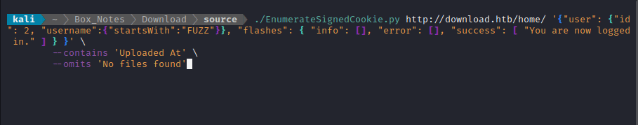

# Express-Cookie-Signer
Signs an Express Cookie using a predefined name and key. Displays the cookie and its signed counterpart on a webpage. It will happily sign any JSON-like object.

This repo also includes a Python script to *interface* with **Express-Cookie-Signer**, called `EnumerateSignedCookie.py`. Use this script for enumeration of a target that requires a signed cookie pair. Just start up the **Express-Cookie-Signer** server, specify a target, specify some filters, and let it do it's thing!


## Installation

Clone the repo and use `npm` to install all dependencies:

```bash
git clone https://github.com/4wayhandshake/Express-Cookie-Signer.git
cd Express-Cookie-Signer
npm i
```


## Webserver Usage

First, start the server using, providing the name of the cookie and the signing key as command-line arguments.

For example:

```
node app.js session_cookie "892123456789418902481234567890634518936754"
```

Then interact with the index page to sign any provided json-like input:


## EnumerateSignedCookie.py:

Use this script to target a host with requests that include a cookie that was signed by **Express-Cookie-Signer**.

1. This script generates JSON-like payloads, url-encodes them, and submits them to http://localhost:3000/auth/api for signing.
2. http://localhost:3000 responds with the two forged cookies.
3. This script sends a request to the actual target (http://attack-me.htb/login) using the two forged cookies.
4. The target responds.
5. This script parses the response to check if the payload was "valid", according to the provided matching criteria.
   ** Only matches HTTP 200 responses, plus the other criteria you specify.

```
usage: EnumerateSignedCookie.py [-h] [--hex-only] [--verbose] [--contains DOES_CONTAIN]
                                [--omits DOES_NOT_CONTAIN]
                                target test_object
```

```
positional arguments:
  target                The URL of the target, Ex. "http://attack-me.htb/login/")
  test_object           a JSON-like object containing the FUZZ keyword, Ex. '{"username":"admin",
                        "password":FUZZ}'

options:
  -h, --help            show this help message and exit
  --hex-only            Use hexadecimal characters only
  --verbose             Print each request
  --contains DOES_CONTAIN
                        a "successful" attempt must contain this string.
  --omits DOES_NOT_CONTAIN
                        a "successful" attempt must NOT contain this string.
```




Please :star: this repo if you found it useful!


---

Enjoy, 

:handshake::handshake::handshake::handshake:
@4wayhandshake
